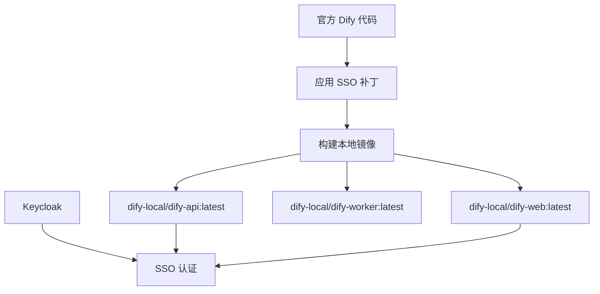

# Dify 本地镜像构建指南

本指南介绍如何基于官方 Dify 代码构建包含 SSO 补丁的本地 Docker 镜像。

## 🏗️ 架构概览



## 📋 前提条件

### 系统要求
- **Docker**: >= 20.10
- **Docker Buildx**: 支持多平台构建
- **Make**: 用于 Makefile 命令
- **Bash**: 用于脚本执行

### 验证环境
```bash
# 检查 Docker 版本
docker --version

# 检查 Docker Buildx
docker buildx version

# 检查 Make
make --version
```

## 🚀 快速开始

### 方法 1: 使用构建脚本（推荐）

```bash
# 1. 进入项目目录
cd /home/connermo/work/dify-ent

# 2. 构建所有组件（自动应用 SSO 补丁）
./scripts/build-local-images.sh

# 3. 查看构建的镜像
docker images | grep dify-local
```

### 方法 2: 使用 Makefile

```bash
# 1. 进入 dify 目录
cd dify

# 2. 应用 SSO 补丁并构建所有镜像
make build-with-sso-patches

# 3. 或者分别构建各个组件
make build-local-api
make build-local-web
make build-local-worker
```

## 🔧 详细构建选项

### 构建脚本选项

```bash
# 查看所有选项
./scripts/build-local-images.sh --help

# 构建特定组件
./scripts/build-local-images.sh api web

# 使用自定义版本号
./scripts/build-local-images.sh -v v1.0.0

# 并行构建（更快）
./scripts/build-local-images.sh --parallel

# 强制重新应用补丁
./scripts/build-local-images.sh --force-patch

# 不使用缓存构建
./scripts/build-local-images.sh --no-cache
```

### Makefile 选项

```bash
# 构建所有本地镜像
make build-local-all

# 构建单个组件
make build-local-api
make build-local-web
make build-local-worker

# 查看本地镜像
make show-local

# 清理本地镜像
make clean-local
```

## 🏃 运行本地镜像

### 1. 启动 Keycloak（SSO 服务）

```bash
# 启动 Keycloak
cd keycloak
docker compose up -d

# 等待服务启动
docker compose logs -f keycloak

# 验证 Keycloak 运行
curl -f http://localhost:8280/realms/dify/.well-known/openid-configuration
```

### 2. 配置环境变量

```bash
# 复制环境变量模板
cp env.local.example .env.local

# 根据需要编辑配置
vim .env.local
```

### 3. 启动 Dify 服务

```bash
# 使用本地构建的镜像启动所有服务
docker-compose -f docker-compose.local-images.yml up -d

# 查看服务状态
docker-compose -f docker-compose.local-images.yml ps

# 查看日志
docker-compose -f docker-compose.local-images.yml logs -f api
```

### 4. 访问服务

- **Dify Web 界面**: http://localhost:3000
- **Dify API**: http://localhost:5001
- **Keycloak 管理**: http://localhost:8280/admin
  - 用户名: `admin`
  - 密码: `admin`

## 📦 镜像信息

构建完成后，你将拥有以下本地镜像：

| 镜像名称 | 用途 | 基础镜像 |
|---------|------|---------|
| `dify-local/dify-api:latest` | API 服务 | 官方 Dify API + SSO 补丁 |
| `dify-local/dify-web:latest` | Web 前端 | 官方 Dify Web + SSO 补丁 |
| `dify-local/dify-worker:latest` | 后台任务 | 官方 Dify API + Worker 模式 |

## 🔧 开发工作流

### 代码修改后重新构建

```bash
# 1. 修改代码后，重新应用补丁和构建
./scripts/build-local-images.sh --force-patch

# 2. 重启相关服务
docker-compose -f docker-compose.local-images.yml restart api web worker
```

### 仅构建特定组件

```bash
# 只构建 API 服务
./scripts/build-local-images.sh api

# 重启 API 服务
docker-compose -f docker-compose.local-images.yml restart api
```

### 调试模式

```bash
# 启用调试模式
echo "DEBUG=true" >> .env.local
echo "FLASK_DEBUG=true" >> .env.local

# 重启服务
docker-compose -f docker-compose.local-images.yml restart api
```

## 🛠️ 故障排除

### 常见问题

#### 1. 构建失败
```bash
# 清理 Docker 缓存
docker builder prune -a

# 重新构建
./scripts/build-local-images.sh --no-cache
```

#### 2. SSO 登录失败
```bash
# 检查 Keycloak 状态
docker compose -f keycloak/docker-compose.yml logs keycloak

# 验证 Keycloak 配置
curl http://localhost:8280/realms/dify/.well-known/openid-configuration
```

#### 3. 服务无法启动
```bash
# 检查端口占用
netstat -tulpn | grep :5001
netstat -tulpn | grep :3000

# 查看详细日志
docker-compose -f docker-compose.local-images.yml logs --tail=100 api
```

#### 4. 数据库连接问题
```bash
# 检查数据库状态
docker-compose -f docker-compose.local-images.yml exec db pg_isready

# 连接数据库
docker-compose -f docker-compose.local-images.yml exec db psql -U postgres -d dify
```

### 日志查看

```bash
# 查看所有服务日志
docker-compose -f docker-compose.local-images.yml logs -f

# 查看特定服务日志
docker-compose -f docker-compose.local-images.yml logs -f api
docker-compose -f docker-compose.local-images.yml logs -f web
docker-compose -f docker-compose.local-images.yml logs -f worker
```

### 清理环境

```bash
# 停止所有服务
docker-compose -f docker-compose.local-images.yml down

# 清理本地镜像
cd dify && make clean-local

# 清理数据卷（谨慎使用）
docker-compose -f docker-compose.local-images.yml down -v
```

## 📚 高级配置

### 多平台构建

```bash
# 构建支持 ARM64 的镜像
./scripts/build-local-images.sh -p "linux/amd64,linux/arm64"
```

### 自定义镜像名称

```bash
# 使用自定义前缀
./scripts/build-local-images.sh -r my-company/dify
```

### 生产环境配置

```bash
# 复制生产环境配置
cp env.local.example .env.production

# 编辑生产配置
vim .env.production

# 使用生产配置启动
docker-compose -f docker-compose.local-images.yml --env-file .env.production up -d
```

## 🔐 安全注意事项

1. **密钥管理**: 在生产环境中使用强密钥
   ```bash
   # 生成新的 SECRET_KEY
   openssl rand -base64 42
   ```

2. **数据库密码**: 修改默认数据库密码
3. **Keycloak 配置**: 修改默认的客户端密钥
4. **网络安全**: 配置防火墙规则，限制端口访问

## 📖 相关文档

- [Dify 官方文档](https://docs.dify.ai/)
- [Keycloak 文档](https://www.keycloak.org/documentation)
- [Docker Compose 文档](https://docs.docker.com/compose/)

## 🆘 获取帮助

如果遇到问题，请：

1. 查看本文档的故障排除部分
2. 检查项目的 Issues
3. 查看相关日志文件

---

**注意**: 本地构建的镜像包含企业级 SSO 功能，适用于内部开发和测试环境。

