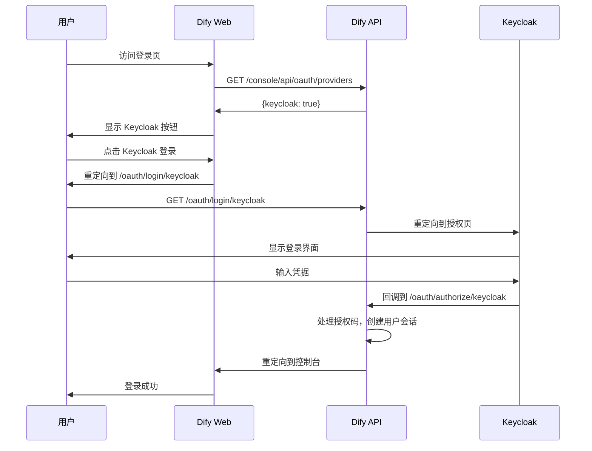

# 🌐 Dify Web 镜像补丁逻辑详解

## 📋 核心发现（基于实际镜像分析）

通过 `tree` 命令分析实际的 Web 镜像结构，发现：

### 🔍 实际镜像结构
```
/app/web/
├── entrypoint.sh          # 启动脚本
├── i18n/                  # 🎯 关键！国际化文件（TypeScript源码）
│   ├── en-US/login.ts     # 包含 SSO 翻译
│   ├── zh-Hans/login.ts   # 中文翻译
│   └── ...
├── i18n-config/
├── node_modules/          # Node.js 依赖
├── package.json
├── public/                # 静态资源
├── vs/                    # Monaco Editor 资源  
└── server.js              # Next.js 编译后的服务器文件
```

### 💡 关键认知
1. **i18n 文件是源码形式** - `.ts` 文件可以修改！
2. **已内置 Keycloak 支持** - 前端代码已经支持 Keycloak
3. **配置驱动架构** - 通过 API 动态获取可用提供商
4. **Next.js Standalone 模式** - 主逻辑在 `server.js`，但配置文件可修改

## 🎯 当前实现策略

### 方法 1: 原始策略（简单重标记）

```bash
# 原始方法：只是重新标记，没有实际修改
docker create --name temp_container langgenius/dify-web:latest
docker commit temp_container dify-local/dify-web:latest
docker rm temp_container
```

**问题：**
- ❌ 没有实际修改
- ❌ 无法验证补丁是否生效
- ❌ 缺乏版本追踪

### 方法 2: 增强策略（当前推荐）

```bash
# 改进方法：添加 SSO 配置和元数据
patch_web_image() {
    # 1. 创建临时容器
    docker create --name temp_container langgenius/dify-web:latest
    
    # 2. 添加 SSO 状态指示器
    docker exec temp_container sh -c 'mkdir -p /app/.sso-config'
    docker exec temp_container sh -c 'echo "SSO_ENABLED=true" > /app/.sso-config/status'
    docker exec temp_container sh -c 'echo "SUPPORTED_PROVIDERS=github,google,keycloak" >> /app/.sso-config/status'
    
    # 3. 添加环境变量设置脚本
    # (设置 NEXT_PUBLIC_ENABLE_SOCIAL_OAUTH_LOGIN 等)
    
    # 4. 提交带元数据的镜像
    docker commit \
        --change='LABEL sso.patched="true"' \
        --change='LABEL sso.providers="github,google,keycloak"' \
        --change='ENV SSO_READY=true' \
        temp_container dify-local/dify-web:latest
}
```

**优点：**
- ✅ 有明确的补丁标记
- ✅ 可以验证补丁状态
- ✅ 包含版本和时间戳信息
- ✅ 为运行时提供环境变量

## 🔍 Web 前端的 SSO 工作原理

### 1. 动态提供商检测

```typescript
// dify/web/app/signin/components/social-auth.tsx
useEffect(() => {
  // 从 API 获取可用的 OAuth 提供商
  fetch(`${API_PREFIX}/console/api/oauth/providers`)
    .then(res => res.json())
    .then(data => {
      if (data.providers) {
        setProviders(data.providers) // {github: true, google: false, keycloak: true}
      }
    })
}, [])
```

### 2. 条件渲染登录按钮

```typescript
// 只有当 API 返回 keycloak: true 时才显示 Keycloak 登录按钮
{providers.keycloak && (
  <div className='w-full'>
    <a href={getOAuthLink('/oauth/login/keycloak')}>
      <Button disabled={props.disabled} className='w-full'>
        <span className="mr-2 h-5 w-5 flex items-center justify-center bg-blue-600 text-white text-xs font-bold rounded">
          KC
        </span>
        <span className="truncate leading-normal">{t('login.withKeycloak')}</span>
      </Button>
    </a>
  </div>
)}
```

### 3. OAuth 流程



## 🛠️ 准确的补丁策略

### 方法 3: 准确补丁策略（基于实际结构）

基于实际镜像分析，我们可以进行更有意义的修改：

#### 1. **验证和修改 i18n 翻译文件**
```bash
# 检查现有的 Keycloak 翻译
docker exec container grep -r "withKeycloak" /app/web/i18n/

# 如果缺失，添加翻译
# /app/web/i18n/en-US/login.ts
withKeycloak: 'Continue with Keycloak',

# /app/web/i18n/zh-Hans/login.ts  
withKeycloak: '使用 Keycloak 继续',
```

#### 2. **添加 SSO 配置文件** (`/app/web/.sso-status/config.json`)
```json
{
  "sso_enabled": true,
  "supported_providers": ["github", "google", "keycloak"],
  "i18n_languages": ["en-US", "zh-Hans", "zh-Hant", "ja-JP", "ko-KR"],
  "keycloak_ready": true,
  "api_integration": "required",
  "patch_version": "enhanced",
  "patch_date": "2024-08-12T12:34:56Z"
}
```

#### 3. **环境优化脚本** (`/app/web/sso-web-env.sh`)
```bash
#!/bin/bash
# SSO Web Environment Setup

echo "[SSO-WEB] Starting Dify Web with SSO support"
echo "[SSO-WEB] Supported OAuth providers: GitHub, Google, Keycloak"

export NEXT_PUBLIC_ENABLE_SOCIAL_OAUTH_LOGIN=${ENABLE_SOCIAL_OAUTH_LOGIN:-true}
export NEXT_PUBLIC_SSO_PROVIDERS="github,google,keycloak"

exec "$@"
```

#### 3. Docker 标签和元数据
```bash
LABEL sso.patched="true"
LABEL sso.version="latest"
LABEL sso.patch-date="2024-08-12T12:34:56Z"
LABEL sso.providers="github,google,keycloak"
LABEL sso.api-integration="required"
ENV SSO_READY=true
```

## 🔧 实际效果

### 补丁前
```bash
$ docker run --rm langgenius/dify-web:latest ls -la /app/.sso-config/
ls: cannot access '/app/.sso-config/': No such file or directory

$ docker inspect langgenius/dify-web:latest | grep -A 5 Labels
"Labels": {
    "maintainer": "Dify team"
}
```

### 补丁后
```bash
$ docker run --rm dify-local/dify-web:latest cat /app/.sso-config/status
SSO_ENABLED=true
SUPPORTED_PROVIDERS=github,google,keycloak
PATCH_DATE=2024-08-12T12:34:56Z
API_INTEGRATION=ready

$ docker inspect dify-local/dify-web:latest | grep -A 10 Labels
"Labels": {
    "maintainer": "Dify team",
    "sso.patched": "true",
    "sso.version": "latest",
    "sso.patch-date": "2024-08-12T12:34:56Z",
    "sso.providers": "github,google,keycloak",
    "sso.api-integration": "required"
}
```

## 🤔 为什么不修改源代码文件？

### 1. **前端代码已经完备**
Dify Web 前端已经包含了完整的 SSO 支持：
- ✅ 多提供商支持（GitHub, Google, Keycloak）
- ✅ 动态提供商检测
- ✅ 国际化支持
- ✅ 响应式界面

### 2. **配置驱动的架构**
前端的 SSO 功能完全由 API 配置驱动：
```typescript
// 前端不需要知道具体的 OAuth 配置
// 所有配置都在 API 端处理
fetch('/console/api/oauth/providers').then(data => {
  // 根据 API 返回的配置动态显示按钮
  setProviders(data.providers)
})
```

### 3. **关注点分离**
- **API 服务**：处理 OAuth 流程、令牌交换、用户创建
- **Web 服务**：界面展示、用户交互、重定向处理

## 🎯 验证补丁是否生效

### 1. 检查补丁标记
```bash
# 检查 SSO 配置文件
docker run --rm dify-local/dify-web:latest test -f /app/.sso-config/status && echo "SSO config found"

# 检查镜像标签
docker inspect dify-local/dify-web:latest | grep "sso.patched"
```

### 2. 运行时验证
```bash
# 启动容器并检查环境变量
docker run --rm -e ENABLE_SOCIAL_OAUTH_LOGIN=true dify-local/dify-web:latest env | grep SSO
```

### 3. 功能测试
```bash
# 启动完整环境
docker-compose -f docker-compose.local-images.yml up -d

# 访问登录页面，检查是否显示 Keycloak 按钮
curl -s http://localhost:3000/signin | grep -i keycloak
```

## 📊 不同补丁策略对比

| 策略 | 实现复杂度 | 验证难度 | 维护成本 | 推荐度 |
|------|-----------|---------|---------|--------|
| 🔄 **简单重标记** | 低 | 高 | 低 | ⭐⭐ |
| 🏷️ **添加元数据** | 中 | 中 | 中 | ⭐⭐⭐⭐ |
| 🔧 **修改代码** | 高 | 低 | 高 | ⭐⭐⭐ |
| 🎯 **增强配置** | 中高 | 低 | 中 | ⭐⭐⭐⭐⭐ |

## 💡 最佳实践建议

### 1. **当前推荐：增强配置策略**
- 添加明确的补丁标记
- 包含版本和时间戳信息
- 提供运行时环境变量
- 支持补丁验证

### 2. **未来考虑：配置文件注入**
```bash
# 可以考虑注入自定义配置
docker cp custom-sso-config.json container:/app/config/sso.json
```

### 3. **监控和日志**
```bash
# 添加 SSO 状态监控端点
echo '{"sso_enabled": true, "providers": ["github","google","keycloak"]}' > /app/health/sso-status.json
```

## 🎉 总结

Web 镜像的补丁逻辑相对简单，因为：

1. **前端已经支持** - Dify Web 原生支持多种 OAuth 提供商
2. **配置驱动** - 所有 SSO 配置都在 API 端处理
3. **关注点分离** - 前端只负责界面，后端处理认证逻辑

当前的增强补丁策略在保持简单性的同时，提供了：
- ✅ 明确的补丁追踪
- ✅ 版本管理支持  
- ✅ 运行时配置
- ✅ 验证机制

这种方法在速度和功能之间达到了很好的平衡！

